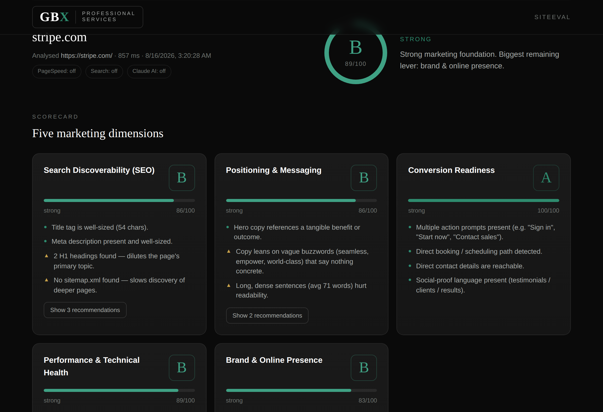

# GBX SiteEval — Marketing Potential Evaluator

Enter a company's website → get an instant, **GBX Professional Services–branded**
marketing scorecard with grades, findings, and a prioritised action plan.

Built the GBX way: **plain language, clear recommendations, no vague consulting
filler.** Dark, premium, results-led.



---

## What it does

Point it at any URL. SiteEval fetches the live site, reads its structure, copy
and marketing signals, and scores it across **five dimensions**:

| Dimension | What it measures | Weight |
|---|---|---|
| **Search Discoverability (SEO)** | Can search engines find, index and understand the page? Title, meta, headings, indexability, sitemap, structured data. | 22% |
| **Positioning & Messaging** | Does the hero say what they do, for whom, and to what outcome? Flags buzzwords and dense copy. | 20% |
| **Conversion Readiness** | Can a visitor take the next step? CTAs, lead capture, contact paths, social proof, nurture. | 20% |
| **Performance & Technical Health** | HTTPS, mobile viewport, page weight, server speed, script bloat, image hygiene. | 18% |
| **Brand & Online Presence** | Analytics maturity, ad pixels, social profiles, share previews, content hub. | 20% |

Each run returns an overall grade (A–F), per-dimension scorecards, a **top-10
prioritised action plan** ranked by impact, quick wins, and a snapshot of what
was seen.

---

## Run it

```bash
npm install
npm start
# → http://localhost:3000
```

That's it. **Everything works with zero API keys** — the core engine is
~40 heuristic checks that run server-side against the live site.

### CLI

```bash
npm run cli -- stripe.com          # pretty terminal report
npm run cli -- stripe.com --json   # full JSON
```

---

## Optional API depth (hybrid engine)

The engine is **heuristics-first with optional adapters** that light up if you
add keys. Copy `.env.example` to `.env` and fill in any you want — each degrades
gracefully to "not configured" if absent.

| Key | Adds |
|---|---|
| `ANTHROPIC_API_KEY` | **Editorial read** — a GBX strategist's qualitative verdict on positioning, clarity and CTA strength, plus a proposed rewrite of the hero headline. Uses the Claude API. |
| `PAGESPEED_API_KEY` | Real Google **PageSpeed / Lighthouse** performance score + Core Web Vitals (LCP/CLS/TBT), blended into the Performance dimension. |
| `SEARCH_PROVIDER` + `SEARCH_API_KEY` | Real **search-footprint** signal (how discoverable the brand is beyond its own site). Supports `serpapi` or `brave`. |

Adapter status is shown live in the report header (on/off pills).

---

## How it's built

```
server.js                Express server + static UI + /api/evaluate
src/
  cli.js                 Terminal runner
  engine/
    analyze.js           Orchestrator: fetch → extract → checks → score → plan
    fetchSite.js         Live fetch + robots/sitemap/https probes
    extract.js           DOM → flat "facts" object
    grade.js             Scoring vocabulary (letter grades, bands, result builder)
    checks/              One module per dimension (seo, messaging, conversion,
                         performance, presence)
    adapters/            Optional: claude.js, pagespeed.js, search.js
public/
  index.html  styles.css  app.js   Branded single-page front end
```

**Design tokens** (GBX Brand Guide v1.0) live at the top of `public/styles.css`
in `:root` — re-skinning is a change to those variables only.

- GBX Teal `#2E8B6E` · Deep Teal `#1A5C4A` · Void Black `#0A0A0A` · Charcoal `#1A1A1A` · White `#FFFFFF`

---

## Notes & limits

- Analyses the **entered page** (usually the homepage). Point-in-time, live fetch.
- Heuristics infer intent from markup; some signals (e.g. first-party analytics,
  JS-rendered content) can't always be detected and may under-report. The
  optional adapters exist to close those gaps.
- Respects a soft per-IP rate limit on the API. For heavy use, add caching.

## Roadmap ideas

- Multi-page crawl (services, about, contact) for a fuller picture
- Competitor side-by-side comparison
- PDF export with the GBX cover
- Lead-gen mode: capture the prospect's email to send the full report
